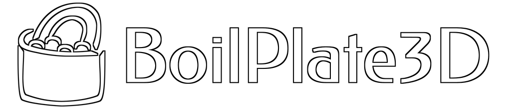

# BoilPlate3D (BP3D)

    
    

BP3D (short for BoilPlate3D) is a MASM-compatible (which means ideally targeting other MASM-compatible assemblers) scripted framework that aims to reduce the amount of redundant boilerplate code by providing a generalized but flexible Win32 form API.

BP3D implements a somewhat OOP-like form API to easily and quickly create and manage windows, oriented for developing 3D graphics with OpenGL. It supports automatic keyboard, mouse (+raw) and joystick input configuration. The forms also provide multiple display device functionality. BP3D started with orientation towards the OpenGL fixed-function pipeline for game development, but can be set up for use with other graphics APIs. BP3D can be included in a MASM-compatible project and used as-is (with direct access to data fields), or compiled into a dynamic library (to use with helper procedures).

Various BP3D extensions (src\\\*.inc) are present, but for now are generally not as well-structured or generalized. Some extensions are not optimized for 64-bit assembly. The neccessity of the existence of some is also debatable.

BP3D aims to support various WinAPI clients out-of-the-box, with minimal (if any) configuration. The tested supported clients include:
- Windows 98SE, ME, 2000 (see BP_COMPATIBILITY_W9X)
- Windows XP - 10
- ReactOS
- Wine (Android - Winlator; Linux - Arch, Debian; BSD - FreeBSD)

If BP3D doesn't work (or works improperly) on your WinAPI host OS, please submit an issue with the details of your setup.

BP3D is built with future x64 support in mind, though it now remains untested and not fully configured for it. Right now, BP3D is tested for compileability with: MASM32, ASMC (32-bit), and UASM (32-bit; 64-bit compile only, can't link). POASM and TASM support might be considered in the future. BP3D supports MASM32 and WinInc Windows include files (headers and libs).

***

Copyright © 2025 Yevhenii Ionenko (aka GreatCorn). All rights reserved.

Licensed under the terms of the MIT license (see LICENSE.txt).

https://greatcorn.github.io/me/
